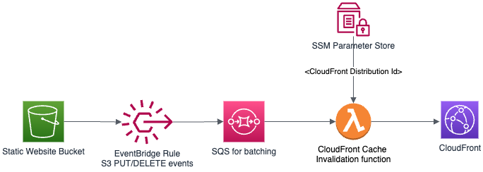

# CloudFront Cache Invalidation Lambda 

## Description
This AWS Lambda function acts as a backend service designed to manage event-driven Amazon CloudFront cache invalidation requests. It is a pivotal component within a larger architecture developed as part of [The Cloud Resume Challenge](https://cloudresumechallenge.dev/). Triggered automatically, it responds to changes occurring within the static website bucket in S3, such as the uploading or deletion of HTML files.



For each file event, Amazon EventBridge dispatches events, which are then batched and sent to the Lambda function through Amazon SQS, serving as a buffer. This batching approach effectively limits the number of invalidation requests forwarded to CloudFront. Given the non-critical nature of this function, no dead letter queue has been configured. 

SSM Parameter Store stores the CloudFront Distribution Id for the website distribution. At runtime, the function fetches this Id and passes it to the CloudFront request for cache invalidation.

## Functionality
- Extract a list of altered files from the EventBridge S3 events encapsulated in the SQS message.
- Generate a CloudFront cache invalidation request, incorporating the list of altered files.

## Getting Started
This project uses [Poetry](https://python-poetry.org/docs/#installation) for dependency management. 

To install `pipx` on macOS:
```
brew install pipx
pipx ensurepath
```
Then use `pipx`: 
```
pipx install poetry
```

Clone this repository, then create a Python [Virtual Environment](https://docs.python.org/3/tutorial/venv.html) inside the directory and activate it by running:
```
python -m venv .venv
source .venv/bin/activate
```

Install the dependencies with:
```
make install-dependencies
```

## Development
Upgrade or add any dependencies with:
```
make upgrade-dependencies
```

Code linting is done with `flake8` and `isort`. Run linting with:
```
make lint
``` 

Run the unit tests with:
```
make test
```

## Build
The function is packaged for deployment in a zip file named `artifact.zip`. Create this with:
```
make build
```
The artifact file will created in the home directory.

## Deployment
As part of the Cloud Resume Challenge project, this function (the artifact zip file) is deployed using Terraform. The code for that can be found here. #TODO add link

## Environment Variables
The function references two environment variables:
- LOG_LEVEL: For logging (Optional: Defaults to INFO)
- CF_DIST_ID_LABEL: The parameter label used to look up the CloudFront Distribution ID value in SSM Parameter Store. (Required)

## Configuration
The call to CloudFront to create an invalidation might fail if multiple invocations of the function are running concurrently. However, parallelization is unnecessary for this specific use case. To ensure only one instance of the function runs at a time, configure the Lambda function with the following setting: 
```
reserved_concurrent_executions = 1
```

The Lambda *event source mapping* for SQS polling apparently creates a minimum of 5 pollers that read from the queue. This means multiple batches of events will be sent to the Lambda function. We can limit this by setting:
```
scaling_config {
    maximum_concurrency = 2
  }
```
This configuration will restrict it to two batches. Consequently, the lambda function will be invoked twice instead of just once, as we would ideally prefer. However, this approach is still preferable to invoking it once for each file. For future reference, Amazon Kinesis might be a better option as a buffer, providing the at-most-once functionality we require. It's important to note that the *reserved concurrent executions* setting for the function has been set to 1. This ensures that despite having two batches, they will execute sequentially, aligning with our requirements.

The following configuration settings in the Lambda *event source mapping* for SQS polling will also limit the number of batches sent:
```
  batch_size                         = 25
  maximum_batching_window_in_seconds = 60
``` 

## License
This project and its Terraform modules are released under the MIT License. See
the bundled [LICENSE](LICENSE.md) file for details.
